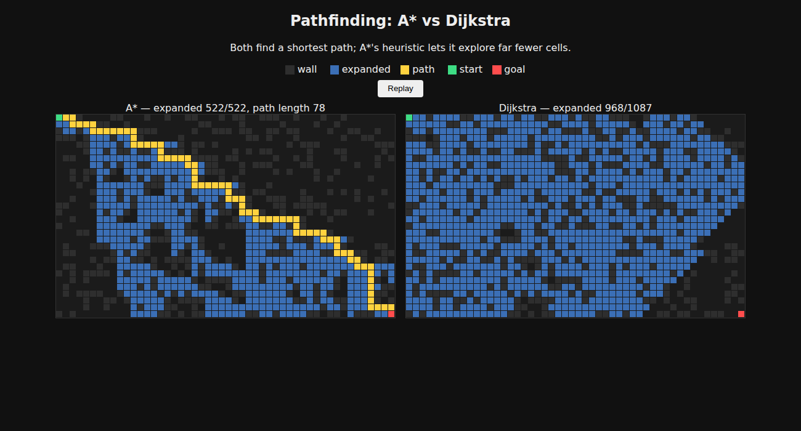

# newton-fractal-project

## Pathfinding visualisation

`pathfinding.py` implements A* (Manhattan heuristic) and Dijkstra on a 4-connected grid.
`visualize.py` runs both on a random obstacle grid and writes `pathfinding.html`, an animated
side-by-side comparison. Open it in any browser (no dependencies, standard library only).

    python visualize.py --rows 30 --cols 50 --seed 1
    python -m unittest discover -s tests

